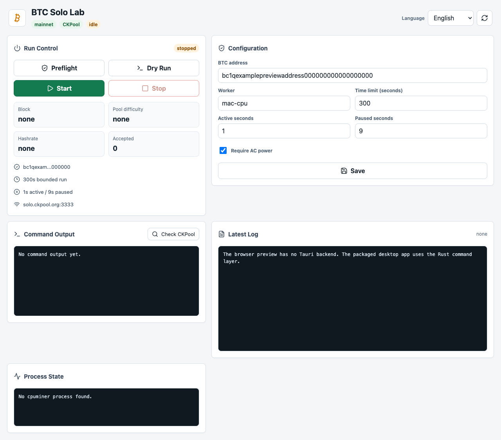

# BTC Solo Lab

[](https://github.com/Jack182617/btc-solo-lab/actions/workflows/ci.yml)

BTC Solo Lab is an open-source desktop and CLI lab for safely experiencing the real Bitcoin mainnet solo mining path.

It is not a profitability tool. It is a bounded learning environment for seeing real Stratum work, Bitcoin mainnet jobs, local `sha256d` hashing, share feedback, logs, and process state without running a local Bitcoin Core full node.



## Why This Exists

Most "mining demos" stop before the real production network boundary. BTC Solo Lab intentionally crosses that boundary in a controlled way:

```text
Mac CPU miner
  -> solo.ckpool.org:3333
  -> Bitcoin mainnet Stratum job
  -> sha256d hashing
  -> share / reject / difficulty feedback
  -> near-zero-probability solo block find
```

The goal is protocol understanding, not revenue. A Mac CPU is effectively a lottery ticket with almost no chance of finding a mainnet block.

## Key Properties

- Real Bitcoin mainnet solo mining flow through CKPool.
- No local full node required.
- Desktop app and CLI workflows.
- Conservative defaults: `1` thread, duty-cycle throttling, `300` second run limit.
- Preflight checks before real starts.
- BTC mainnet address checksum/network validation for `bc1...`, `1...`, and `3...`.
- Path guards for miner binary, log directory, and log file.
- Existing-miner guard before real starts.
- Pool password redaction in dry-run output, process views, and log tails.
- Local-only runtime configuration; real `configs/miner.env` is ignored by Git.
- Release audit for packaged macOS app resources and signing expectations.

## What This Is Not

- Not a profit miner.
- Not a 24/7 mining controller.
- Not custodial payout infrastructure.
- Not a replacement for ASIC mining.
- Not a local Bitcoin Core solo mining stack.

## Architecture

```text
BTC Solo Lab.app / CLI
  -> Tauri command allowlist or shell scripts
  -> configs/miner.env
  -> scripts/preflight.sh
  -> scripts/run-solo-miner.sh
  -> logs/miner-*.log
  -> vendor/cpuminer-multi/cpuminer
  -> stratum+tcp://solo.ckpool.org:3333
  -> Bitcoin mainnet work
```

See [docs/best-practice-plan.md](docs/best-practice-plan.md) for the full operating model.

## Quick Start

Prerequisites on macOS:

- Node.js `20.19+` or `22.12+`
- npm `10+`
- Rust toolchain
- Homebrew
- Xcode Command Line Tools

Install dependencies and build the local miner:

```bash
npm install
./scripts/bootstrap-cpuminer.sh
```

Create local configuration:

```bash
cp configs/miner.env.example configs/miner.env
```

Edit at least:

```bash
BTC_ADDRESS=your-self-custody-mainnet-address
WORKER_NAME=mac-cpu
```

Use a self-custody Bitcoin mainnet address. Do not use an exchange deposit address, Lightning invoice, testnet address, or regtest address.

## Desktop App

Run the local app during development:

```bash
npm run tauri:dev
```

Build and package a local macOS app:

```bash
npm run verify
npm run package:macos
```

Expected local artifacts:

```text
src-tauri/target/release/bundle/macos/BTC Solo Lab.app
src-tauri/target/release/bundle/dmg/BTC Solo Lab_0.1.0_aarch64.dmg
```

The packaged app initializes a writable runtime root under:

```text
~/Library/Application Support/com.local.btcsololab
```

GUI edits write to that runtime directory, not to the source checkout.

For public distribution, replace the local bundle identifier in `src-tauri/tauri.conf.json`, sign with a Developer ID Application certificate, enable notarization, and pass the release audit:

```bash
SIGNING_IDENTITY="Developer ID Application: Your Name (TEAMID)" \
NOTARIZE=1 \
NOTARY_KEYCHAIN_PROFILE=btc-solo-lab \
npm run package:macos
```

## CLI Flow

Run preflight without mining:

```bash
./scripts/preflight.sh
```

Preview the real command without starting the miner:

```bash
DRY_RUN=1 ./scripts/run-solo-miner.sh
```

Start a bounded low-resource mainnet run:

```bash
./scripts/run-solo-miner.sh
```

Inspect process state and recent logs:

```bash
./scripts/status.sh
```

Check CKPool user statistics:

```bash
./scripts/check-ckpool-user.sh
```

Run the standard smoke workflow:

```bash
./scripts/smoke-start.sh
```

By default, smoke is dry and does not start mining. A real short mainnet CPU smoke requires explicit confirmation:

```bash
REAL_START_SMOKE=1 \
REAL_START_CONFIRM=REAL_MAINNET_CPU_MINING \
SMOKE_SECONDS=15 \
./scripts/smoke-start.sh
```

## Safe Defaults

The recommended first-run profile is intentionally slow:

```bash
THREADS=1
THROTTLE_MODE=duty-cycle
DUTY_ACTIVE_SECONDS=1
DUTY_IDLE_SECONDS=9
TIME_LIMIT_SECONDS=300
REQUIRE_AC_POWER=1
LOG_RETENTION=100
```

The first successful run should only prove:

- Stratum connection works.
- Mainnet jobs arrive.
- Local hashrate appears.
- There are no repeated rejects or reconnect loops.
- The Mac remains cool and responsive.

Do not require an accepted share or visible CKPool stats during a short CPU run. At CPU-level hashrate, that can take a very long time or never happen.

## Risk Boundaries

- This is real Bitcoin mainnet mining.
- CKPool provides block templates and relay, and currently documents a `2%` fee if a block is found.
- Stratum is plaintext and exposes BTC address plus worker name.
- CPU solo mining has a near-zero chance of finding a block.
- Logs are local but may still contain public identifiers such as BTC address and worker name.
- Packaged local builds are for self-use unless Developer ID signing, notarization, stapling, DMG verification, and mounted-app verification all pass.

## Verification

Run the project gate:

```bash
npm run verify
```

It covers frontend build, Rust formatting/tests/clippy, shell syntax, dependency audit, dry-run guards, address validation guards, path guard checks, password redaction checks, smoke workflow, and process-state redaction.

CI uses a lighter non-mining gate in [scripts/ci.sh](scripts/ci.sh).

## Open Source Maintenance

- Security policy: [SECURITY.md](SECURITY.md)
- Contribution guide: [CONTRIBUTING.md](CONTRIBUTING.md)
- Roadmap: [ROADMAP.md](ROADMAP.md)
- Changelog: [CHANGELOG.md](CHANGELOG.md)
- Release checklist: [docs/release-checklist.md](docs/release-checklist.md)
- Third-party notices: [THIRD_PARTY_NOTICES.md](THIRD_PARTY_NOTICES.md)

## 中文摘要

BTC Solo Lab 是一个用于真实体验 Bitcoin 主网 solo mining 流程的开源实验工具。重点不是收益，而是让开发者在低资源、可观察、可停止、带 preflight 和日志脱敏边界的环境里理解真实生产网络上的 mining 链路。

中文完整方案见 [docs/best-practice-plan.md](docs/best-practice-plan.md)。

## License

This project is licensed under the GNU General Public License version 2 or later. See [LICENSE](LICENSE).

The local `vendor/cpuminer-multi` miner component is cloned from upstream by `scripts/bootstrap-cpuminer.sh` and is licensed by its upstream authors under GPLv2 or later. See [THIRD_PARTY_NOTICES.md](THIRD_PARTY_NOTICES.md).
